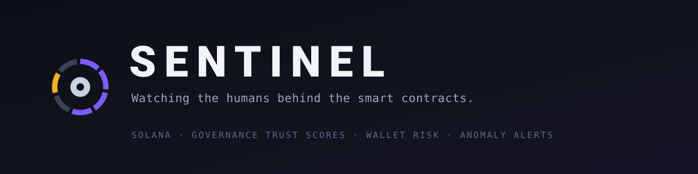

<div align="center">



### Governance trust scores, wallet risk scanning, and real-time anomaly detection for Solana DeFi.

<br>

[](https://frontend-eta-topaz-85.vercel.app)
[](https://solana.com)
[](#roadmap)
[](#license)

<br>


</div>

---

> Code audits are winning. The humans are losing.
> Sentinel scores the governance layer — who holds the keys, what the timelock is set to, and who just changed it.

---

## Why

2026 flipped the DeFi threat model. Attackers stopped fighting the code and started going after the people and processes around it.

The numbers, first half of 2026:

| Metric | H1 2026 | Source |
| --- | --- | --- |
| Recorded incidents | 207 — highest six-month count ever | Immunefi |
| Total stolen | ~$972M — under half of H1 2025 | Immunefi / TRM Labs |
| Median loss per incident | ~$219K (mean ~$4.7M) | TRM Labs |
| Losses from compromised keys & admin credentials | ~40% of all dollars lost | TRM Labs |
| Solana ecosystem losses | ~$326M, second only to Ethereum | Blockaid |
| Share attributed to DPRK-linked groups | ~66% | TRM Labs |

More attacks, smaller average size, and the biggest dollar losses coming from **credentials, admin keys and governance processes — not from bugs in Anchor programs.**

That is precisely the layer nobody monitors. Audits cover the program. STRIDE and formal verification cover correctness. Hypernative and Range cover transactions in flight. Nothing scores the multisig, the timelock, or the proposal that is about to pass.

**Sentinel scores that layer.**

## The 2026 governance attack log

Four incidents, all on Solana, none of them a smart-contract bug:

| Date | Target | Loss | What actually broke | Sentinel signal |
| --- | --- | --- | --- | --- |
| **Apr 1** | Drift Protocol | ~$286M | Security Council takeover via pre-signed durable nonces; multi-week social engineering, DPRK-linked | Timelock removed **5 days before**; multisig cut 3/5 → 2/5; dormant durable nonces |
| **Jun 30 → Jul 6** | BonkDAO | ~$20M | BIP #76. Filed Jun 30, executed Jul 6. The DAO ran a **1% approval quorum** and **no timelock**; the attacker acquired the ~880B BONK needed to clear it, then voted it through. 7 wallets voted in total; attacker-linked wallets held ~99.878% | Capture cost was **$3.96M against a $20M treasury — 5.05x — computable before the proposal was even filed** |
| **Jul 16** | DeFiTuna | ~$580K | Lending pool exploit leaving the USDC pool in deficit | Pool solvency / utilisation break |
| **Jul 17** | Across (SVM) | ~$3.35M | Relayer-side compromise on the Solana deployment; user funds untouched, Risk Labs absorbed it | Off-chain relayer trust boundary |

Drift proved the thesis. **BonkDAO proved something worse: the attack was priced in public before it happened.**

BonkDAO's governance config was readable by anyone. A 1% approval quorum against BONK's supply meant 879,946,007,523 tokens would carry a proposal — about $3.96M at the time — and the treasury behind it was worth roughly $20M. Five times the prize for the price, with no timelock to interrupt execution. None of that required an attack in progress to see. It required someone to look.

The same DAO ran a third governance at a 10% quorum. That one priced out at 0.51x — not worth taking. One config field, same treasury, same day, and the entire difference between exploitable and not.

## What Sentinel does

### 1. Governance trust scores

Every monitored protocol gets a 0–100 score built from four factors:

- **Multisig configuration** — signer count and threshold
- **Timelock duration** — how long admin changes take to land
- **Audit history** — independent reviews on record
- **Admin activity** — recent changes to governance parameters

Jupiter Lend scores 92/100 (4/7 multisig, 72h timelock, formally verified). Drift scored 8/100 at the moment of the exploit (2/5 multisig, zero timelock, compromised).

### 2. Wallet risk scanner

Paste any Solana address to see which protocols you're exposed to, the governance score of each, your aggregate risk level, and the specific weaknesses in the protocols you actually use.

### 3. Real-time anomaly detection

- **Oracle deviations** — Pyth feeds vs 5-minute TWAP (caught JUP/USD at −5.17%)
- **TVL crashes** — cross-protocol via DefiLlama (caught Jupiter Lend −8.5% in one hour)
- **Funding rate extremes** — Binance/Bybit SOL funding as a cascade signal
- **Governance changes** — admin account data writes, timelock edits, multisig rotations
- **Telegram alerts** — critical and high severity pushed instantly

### 4. Hack replay

Interactive timeline of the on-chain signals Sentinel would have surfaced ahead of the $286M Drift exploit — from the Tornado Cash funding on Mar 11 to the cascade alerts on Apr 1.

## Where Sentinel sits

| Tool | Monitors | Drift, Apr 1 | BonkDAO, Jul 6 |
| --- | --- | --- | --- |
| STRIDE / formal verification | Program correctness | Would not have caught it | Would not have caught it |
| Hypernative | Transaction-level threats | Detected during, not before | — |
| Range Security | Real-time tx alerting | No governance layer | No governance layer |
| DefiLlama | TVL metrics | No admin monitoring | No admin monitoring |
| **Sentinel** | **Governance + human layer** | **Timelock removal, 5 days early** | **5.05x capture cost, priced before filing** |

## Verify it yourself

Every figure above is derived from chain state, not quoted from reporting. Reproduce them:

```bash
# Resolve the real DAO — 19 realms answer to the name "bonk"
node backend/src/monitors/realmsTriage.js --mint DezXAZ8z7PnrnRJjz3wXBoRgixCa6xjnB7YaB1pPB263

# Price the takeover, live
node backend/src/monitors/captureCost.js --realm 84pGFuy1Y27ApK67ApethaPvexeDWA66zNV8gm38TVeQ

# Price it under pre-attack conditions
node backend/src/monitors/captureCost.js \
  --realm 84pGFuy1Y27ApK67ApethaPvexeDWA66zNV8gm38TVeQ \
  --price 0.0000045 --prize 20000000
```

The quorum requirement the scanner computes — 879,946,007,523 BONK — matches the ~879.95B independently reported as the threshold the attacker had to clear.

## Architecture

```
┌──────────────────────────────────────┐
│       React Frontend (Vercel)        │
│  Wallet Scanner / Trust Scores       │
│  Dashboard / Alerts / Hack Replay    │
└───────────────┬──────────────────────┘
                │ WebSocket + REST
┌───────────────▼──────────────────────┐
│       Node.js Backend (VPS)          │
│  Express API + WS Server             │
│                                      │
│  ┌──────────────────────────────┐    │
│  │   Anomaly Detection Engine   │    │
│  │   • Governance Monitor       │    │
│  │   • Oracle TWAP Tracker      │    │
│  │   • TVL Crash Detector       │    │
│  │   • Funding Rate Signals     │    │
│  │   • Cascade Risk Scorer      │    │
│  │   • Wallet Scanner           │    │
│  │   • Telegram Alert Bot       │    │
│  └──────────────────────────────┘    │
└──────┬─────┬───────┬──────┬──────────┘
       │     │       │      │
┌──────▼┐ ┌──▼───┐ ┌─▼────┐ ┌▼──────┐
│ Pyth  │ │DeFi  │ │Helius│ │Binance│
│Network│ │Llama │ │ RPC  │ │Bybit  │
│Oracles│ │ TVL  │ │Solana│ │CEX API│
└───────┘ └──────┘ └──────┘ └───────┘
```

## Tech stack

| Layer | Technology |
| --- | --- |
| Frontend | React 18, Vite |
| Backend | Node.js, TypeScript, Express, WebSocket |
| Blockchain | Solana Web3.js, Helius RPC |
| Oracles | Pyth Network Hermes API |
| TVL data | DefiLlama API |
| CEX data | Binance + Bybit Futures API |
| Alerts | Telegram Bot API |
| Infra | PM2, Nginx, Vercel |

## Protocols monitored

| Protocol | Type | Trust score | Status |
| --- | --- | --- | --- |
| Jupiter Lend | Lending | 92/100 — Excellent | Active |
| Kamino Finance | Lending | 88/100 — Excellent | Active |
| Solend | Lending | 75/100 — Good | Active |
| MarginFi | Lending | 72/100 — Good | Active |
| Drift Protocol | Perp DEX | 8/100 — Critical | Frozen |

## Run it locally

**Backend**

```bash
cd backend
cp ../.env.example ../.env   # add your Helius API key
npm install
npm run dev
```

**Frontend**

```bash
cd frontend
npm install
npm run dev
```

The frontend falls back to demo mode with real cached data when the backend is unreachable, so the UI is fully explorable without keys.

## Roadmap

**Shipped**

- [x] Governance trust scores across 5 Solana protocols
- [x] Wallet risk scanner with protocol exposure mapping
- [x] Pyth oracle monitoring with TWAP deviation detection
- [x] TVL crash detection across protocols
- [x] CEX funding rate signals and cascade risk scoring
- [x] Drift hack replay timeline
- [x] Telegram alert bot

**Shipped — the BonkDAO lessons**

- [x] **Capture cost scanner** — quorum requirement x token price vs treasury value, per governance
- [x] **Realm triage** — resolve the authentic DAO by governed mint and treasury, not display name
- [x] **Realms proposal monitor** — live proposals scored for capture, solo-pass, apathy, concentration
- [x] **Fresh-capital voting detection** — governance deposits created after the proposal opened

**Next**

- [ ] Slippage-adjusted capture cost using orderbook depth
- [ ] Capture-cost leaderboard across every Solana DAO
- [ ] Alert on governance config changes that lower capture cost

**Also queued**

- [ ] On-chain governance change detection via account subscriptions
- [ ] Durable nonce watchdog for protocol admin wallets
- [ ] Historical governance change log with timeline view
- [ ] Discord bot integration
- [ ] More protocols: Flash Trade, Zeta Markets, Mango Markets

## Business model

1. **Governance-as-a-Service** — protocols pay for continuous monitoring and trust score certification
2. **Premium wallet scanner** — subscription for funds and desks wanting exposure reports
3. **Alert API** — webhook / Telegram / Discord feeds for teams tracking ecosystem governance health

## Brand assets

| Asset | File | Use |
| --- | --- | --- |
| Animated banner | [`assets/banner.svg`](./assets/banner.svg) | README headers, slide title cards |
| Mark, dark backgrounds | [`assets/logo.svg`](./assets/logo.svg) | Avatars, stickers, dark decks |
| Mark, light backgrounds | [`assets/logo-light.svg`](./assets/logo-light.svg) | Print, light decks |

The mark is a seven-seat signer ring: four seats signed, one flagged. It is a multisig at quorum with something wrong in it — the exact state Sentinel exists to catch. Palette: `#7C5CFF` signed · `#FFB020` flagged · `#3A4358` idle · `#C9D1E3` core · `#0D0F16` ink.

Free to use for community events and meetups. Please don't restyle the mark or recolour the flagged seat.

## Built by

**[@Makabeez](https://github.com/Makabeez)** — solo builder, Geneva. Background in air logistics operations, now building on-chain intelligence tooling. Previous: The Scavenger (Polymarket liquidation bot), Frontier Overwatch (Sui intelligence dashboard), ARCA (CI/CD security agent).

Contributions, protocol suggestions and governance data corrections are welcome — open an issue.

## License

MIT

---

<div align="center">
<sub>The next nine-figure exploit won't be a smart contract bug. It'll be another governance failure.</sub>
</div>
